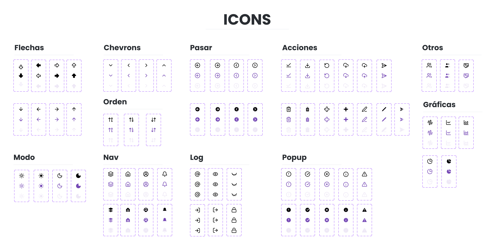
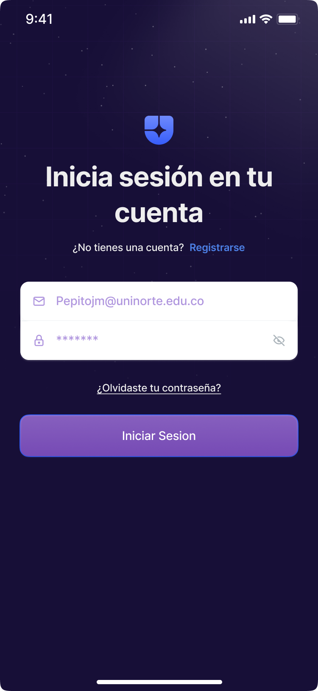
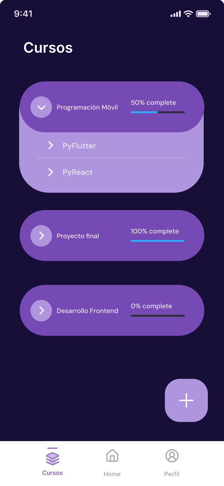
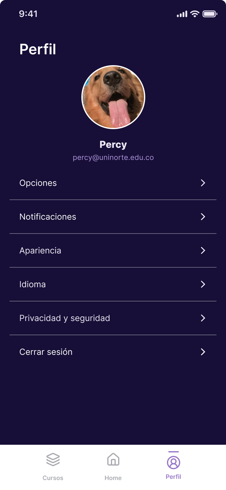

# 📄 Propuesta Inicial PeerSync

## 1. Problemática del Proyecto

En la educación universitaria, el trabajo colaborativo constituye una estrategia pedagógica clave para el desarrollo de competencias técnicas, sociales y profesionales. Sin embargo, los modelos tradicionales de evaluación en el aula suelen basarse principalmente en calificaciones asignadas exclusivamente por el docente, lo que limita la participación activa del estudiante y no siempre permite capturar de manera precisa el desempeño individual dentro de actividades grupales. Este enfoque centrado únicamente en la evaluación docente puede generar percepciones de inequidad cuando la nota final de un proyecto colaborativo no refleja el aporte real de cada integrante del equipo. Además, la concentración de la evaluación en momentos específicos del curso (como entregas finales o exámenes) incrementa la presión académica y reduce las oportunidades de retroalimentación continua.

De acuerdo con Moreno Pabón (2023), los procesos evaluativos en la educación superior deben evolucionar hacia modelos más dinámicos y participativos que fomenten la responsabilidad, la reflexión crítica y la transparencia en el aprendizaje. La autora resalta la importancia de integrar prácticas que permitan observar el progreso del estudiante y fortalecer su implicación activa en los procesos formativos.

En la misma línea, Basurto-Mendoza et al. (2021) sostienen que las prácticas de coevaluación constituyen enfoques innovadores dentro de la práctica pedagógica, ya que favorecen la identificación de vacíos de conocimiento, incrementan la motivación y promueven el desarrollo de habilidades críticas. Asimismo, estas metodologías proporcionan a los docentes información más auténtica sobre el progreso real de los estudiantes en contextos colaborativos Esta fragmentación tecnológica limita la posibilidad de implementar procesos de retroalimentación continua y análisis comparativo del desempeño.

En este contexto, se identifica la necesidad de desarrollar una solución tecnológica que permita formalizar la evaluación colaborativa mediante una aplicación móvil estructurada. De esta manera, el proyecto responde a la necesidad de transformar los procesos tradicionales de evaluación en entornos universitarios, integrando fundamentos pedagógicos contemporáneos con una solución tecnológica estructurada y sostenible.

 

## 2. Referentes y Análisis del Contexto Actual

Con el fin de fundamentar la propuesta, se realizaron reuniones con profesores del Departamento de Ingeniería de Sistemas de la Universidad del Norte, quienes implementan actividades colaborativas dentro de sus cursos y utilizan distintos mecanismos para evaluar el desempeño individual en trabajos grupales.

A partir de estas entrevistas, se identificaron las siguientes herramientas actualmente utilizadas en procesos de coevaluación:

### 

FeedbackFruits es una plataforma integrada comúnmente en sistemas LMS que permite implementar dinámicas de retroalimentación entre pares.

### Ventajas identificadas:
- Permite evaluación estructurada por criterios.
- Facilita la asignación de retroalimentación entre estudiantes.
- Ofrece cierto nivel de automatización en la recopilación de respuestas.

### Limitaciones observadas:
- Dependencia del LMS institucional (como Brisghtspace).
- Interfaz no siempre optimizada para dispositivos móviles.
- Configuración avanzada puede resultar compleja.
- Visualización de métricas no siempre personalizada por curso o actividad.

### 

Según los docentes consultados, una de las prácticas más frecuentes es la creación de formularios personalizados con escalas estimativas (por ejemplo, de 1 a 5) para que los estudiantes evalúen a sus compañeros.

### Ventajas:
- Fácil creación y distribución.
- Accesibilidad multiplataforma.
- Flexibilidad en la definición de preguntas.

### Limitaciones:
- Consolidación manual o semiautomática de resultados.
- Ausencia de trazabilidad histórica integrada.
- No existe diferenciación estructurada por rol.
- No hay cálculo automático de métricas por grupo, curso o estudiante.
- No se integran ventanas de tiempo controladas desde la lógica del sistema.  

 

Además de las herramientas mencionadas por los docentes consultados, se realizó una revisión exploratoria de soluciones implementadas en contextos universitarios a nivel internacional. Esta búsqueda permitió identificar plataformas especializadas en la evaluación del trabajo en equipo que cuentan con respaldo académico y uso documentado en instituciones de educación superior. A continuación, se presentan dos referentes adicionales relevantes para el análisis comparativo de la propuesta.

### 

CATME (Comprehensive Assessment for Team-Member Effectiveness) es una herramienta ampliamente utilizada en educación superior para evaluar la efectividad de los miembros en equipos de trabajo, desorrallad por por un equipo de investigadores, destacando Matthew W. Ohland, Misty L. Loughry, y Richard A. Layton, con apoyo de la National Science Foundation (NSF) y la Universidad de Purdue[^1].

### Ventajas:
- Sistema validado académicamente.
- Evaluación por múltiples dimensiones de desempeño.
- Reportes estructurados para docentes.

### Limitaciones:
- Plataforma externa con suscripciones institucionales.
- Menor flexibilidad para personalización específica del curso.
- No siempre integrada a flujos académicos internos.
- Interfaz menos intuitiva para uso móvil continuo.

### 

El módulo Workshop de Moodle permite implementar procesos de evaluación entre pares dentro del entorno LMS.

### Ventajas:
- Integración directa con cursos existentes.
- Gestión automática de asignaciones de evaluación.
- Configuración de rúbricas estructuradas.

### Limitaciones:
- Curva de configuración compleja.
- Experiencia de usuario poco optimizada para móviles.
- Interfaz centrada en entorno web.
- Visualización analítica limitada en comparación con herramientas especializadas.

 

### Hallazgos Generales:

A partir del análisis de estas herramientas y de las entrevistas con docentes, se identifican patrones comunes:

- La mayoría de soluciones no están diseñadas específicamente como aplicaciones móviles nativas.
- La visualización de métricas suele ser limitada o requiere exportación manual de datos.
- No existe una integración clara entre creación de curso, gestión de grupos, generación de actividades y análisis estadístico en una sola herramienta ligera.
- Las soluciones actuales priorizan la recopilación de datos, pero no siempre la visualización analítica estructurada y diferenciada por rol.

 

## 3. Composición y diseño de la solución
Se propone el desarrollo de una aplicación móvil nativa multiplataforma construida en Flutter, que integre en **una sola solución** los roles de docente y estudiante mediante un sistema de autenticación con diferenciación de vistas según perfil.

A diferencia de modelos que separan aplicaciones por rol o dependen exclusivamente de entornos LMS, esta propuesta centraliza la gestión académica en una única aplicación, garantizando coherencia de experiencia de usuario, mantenimiento simplificado y futura escalabilidad.

Esta decisión se justifica por:
- Reducción de complejidad técnica.
- Unificación de autenticación.
- Experiencia coherente.
- Facilita futuras extensiones (por ejemplo, rol administrador).

### 3.1. Arquitectura de la Aplicación
La solución se estructura bajo principios de **Clean Architecture**, organizando el sistema en capas independientes:

**1. Presentation Layer**
- Interfaces gráficas desarrolladas en Flutter.
- Controladores implementados con GetX.
- Manejo de estado reactivo.
- Navegación estructurada por roles.

**2. Domain Layer**
- Entidades del sistema (User, Course, GroupCategory, Assessment, Evaluation).
- Casos de uso (CreateCourse, JoinCourse, CreateAssessment, SubmitEvaluation, CalculateMetrics).
- Reglas de negocio:
  - No permitir autoevaluación.
  - Respetar ventana de tiempo.
  - Controlar visibilidad pública o privada.

**3. Data Layer**
- Repositorios.
- Fuentes de datos.
- Persistencia mediante servicios de Roble.

**4. External Services**
- Autenticación (correo y contraseña).
- Base de datos en Roble.
- Gestión de almacenamiento estructurado.

 

## 4. Flujo Funcional
La aplicación implementa un flujo basado en roles (Teacher / Student). Tras iniciar sesión con correo institucional y contraseña, el sistema valida credenciales y consulta en Roble el perfil asociado (rol). Según el rol, dirige al usuario a su interfaz correspondiente.

 

### 4.1. Autenticación
---
1. El usuario ingresa a la app y visualiza **Login**.
2. Ingresa **correo institucional** + **contraseña**.
3. El sistema autentica con Roble.
4. Se consulta el perfil del usuario:
   - Si es **Teacher** → se carga **Teacher Home**.
   - Si es **Student** → se carga **Student Home**.
5. La sesión se mantiene activa hasta que el usuario haga **Log out**.

 

### 4.2. Flujo: Rol Teacher
---

**4.2.1 Navegación principal (Teacher)**

NavBar inferior:
- Home
- Cursos
- Perfil

*Acción global:* **Botón (+)** para crear curso o crear assessment según la pantalla.

**4.2.2 Teacher Home (inicio)**
Al entrar:
- Se muestran todos los **cursos recientes** creados por el docente.
- Se muestran **indicadores globales** de los cursos del docente.

*Acción:* Botón **(+) Crear curso**.

**4.2.3 Crear curso**
Al presionar (+):
- Se abre un **popup** con:
  - **Nombre del curso** (obligatorio)
  - **Importar CSV** de categorías de los grupos (opcional) *(representa importación desde Brightspace)*
  - Botones: ✅ **Crear** | ✖️ **Cancelar**

Al confirmar **Crear**:
1. Se guarda el curso en Roble.
2. El sistema genera un **Course Code** único (verificación privada).
3. Si se importó CSV, se registran:
   - Group Categories, y sus respectivos grupos
   - Members por group

Luego, se traslada a la **vista del curso**.

**4.2.4 Vista de Curso**
Encabezado:
- Flecha atrás ←
- **Nombre del curso**
- Acceso rápido a **Course Code** (copiar/compartir)

Contenido:
- Lista de **Group Categories** importadas (o estado “sin categorías importadas”).

*Acción:* Botón **(+) Crear Assessment**.

**4.2.5 Crear Assessment / Activity**
Al presionar (+):
- Se abre popup con:
  - **Name**
  - **Time window** (duración en minutos u horas)
  - **Visibility**
    - **Public**: resultados visibles a miembros del grupo (criterios + score general)
    - **Private**: resultados visibles solo para el docente
  - ✅ **Crear**   | ✖️ **Cancelar**

Reglas:
- Assessment queda asociado a una **Group Category** (para saber qué equipos participan).
- Se define ventana de tiempo → habilita estado **Activa/Expirada**.
- Se habilita evaluación entre pares **sin self-evaluation**.

Al crear:
- Se agrega el assessment a las actividades del Group Category.

**4.2.6 Resultados por Assessment**
Al abrir un assessment:
1. Se muestra una **gráfica general** del desempeño en esa actividad:
   - Promedio global de la actividad
   - Radar por criterios (promedio de la actividad)
2. Debajo se listan los **grupos** de la categoría asociada.

Al entrar a un grupo:
- Se muestra tabla/lista con cada integrante:
  - Promedio por criterio
  - **Score general ponderado**

**4.2.7 Cursos**
Pantalla “Cursos” muestra:
- Todos los cursos creados
- Acción (+) **Crear curso** (mismo popup del Home)
- Al abrir un curso → mismo flujo descrito en **Vista de Curso**.

**4.2.8 Perfil**
- Datos básicos del docente
- Opción flotante/menú: **Log out**

 

### 4.3 Flujo: Rol Student
---

**4.3.1 Navegación principal (Student)**
NavBar inferior:
- **Home**
- **Cursos**
- **Perfil**

Acción global:
- Botón flotante **(+) Unirse a curso** (por código).

**4.3.2 Student Home (inicio)**
Al entrar:
- Cursos recientes
- Indicadores globales del estudiante

Acción:
- Botón flotante **(+) Unirse a curso**.

**4.3.3 Unirse a curso**
Al presionar (+):
- Popup:
  - Campo **Course Code**
  - ✅ Unirse | ✖️ Cancelar

Al confirmar:
1. Se valida el código.
2. Se registra al estudiante en el curso.
3. Se navega a la **vista del curso**.

**4.3.4 Vista de Curso**
Muestra:
- Categorías de grupo donde el estudiante pertenece (por ejemplo “Group Category A”).

Al entrar a una categoría:
- Se muestra:
  1. **Gráfica resumen del estudiante en esa categoría**
     - score promedio por criterio
     - score general promedio en esa categoría
  2. Listado de **Assessments** de esa categoría con estado:
     - **Activa** (en ventana de tiempo)
     - **Expirada**
     - **Pendiente** (si existe una asignación que aún no completa y está activa)

---

**4.3.5 Vista de Assessment**
Al abrir una actividad:
1. Se muestra una gráfica con sus resultados (si aplica por visibilidad):
   - Si **Public**: ver score general y por criterio
   - Si **Private**: ocultar resultados (mostrar mensaje “Resultados visibles solo para el docente”)
2. Debajo:
   - Estado de la actividad: **Activa / Expirada**
   - Sección de evaluaciones:
     - **Pendientes** (si aún no ha evaluado a alguien)
     - **Realizadas** (si ya evaluó)

Si está **Activa**:
- Puede evaluar a compañeros (sin incluirse).
- Puede **editar** evaluaciones ya enviadas mientras la ventana esté abierta (guardar cambios).

Si está **Expirada**:
- Evaluación en modo lectura (sin edición).

---

**4.3.6 Cursos**
Pantalla “Cursos” muestra:
- Todos los cursos a los que pertenece
- Botón (+) para **unirse a curso** (mismo popup)
- Al abrir un curso → mismo flujo descrito en **Vista de Curso**.

---

**4.3.7 Perfil**
- Datos básicos del estudiante
- Opción flotante/menú: **Log out**

---

## 4.4 Verificación privada (requisito de invitación)
Para cumplir el requisito de “invitación privada o verificación”, el sistema genera un **Course Code** al crear un curso.  
El docente comparte este código con sus estudiantes, y el estudiante lo utiliza para unirse.  
Este mecanismo controla el acceso sin exponer cursos públicamente.

 

## 5. Diseño del prototipo:

### 5.1. Componentes

 

### 5.2. Prototipo

**Inicio de Sesión y Registro:**

 

**Vistas Teacher:**

 

**Vistas Student:**

 

## 6. Referencias

* Basurto-Mendoza, S. T., Moreira-Cedeño, J. A., Velásquez-Espinales, A. N., & Rodríguez, M. (2021). Autoevaluación, coevaluación y heteroevaluación como enfoque innovador en la práctica pedagógica y su efecto en el proceso de enseñanza-aprendizaje.

* Moreno Pabón, C. (2023). Importancia de la evaluación, coevaluación y autoevaluación en la educación universitaria: Experiencias en la Educación Artística. HUMAN Review, 2023(2), 1–12. 

* Ohland, M. W., Loughry, M. L., Woehr, D. J., Bullard, L. G., Felder, R. M., Finelli, C. J., Layton, R. A., Pomeranz, H. R., & Schmucker, D. G. (2012). The comprehensive assessment of team member effectiveness: Development of a behaviorally anchored rating scale for self- and peer evaluation. Academy of Management Learning & Education, 11(4), 609–630. https://doi.org/10.5465/amle.2010.0177